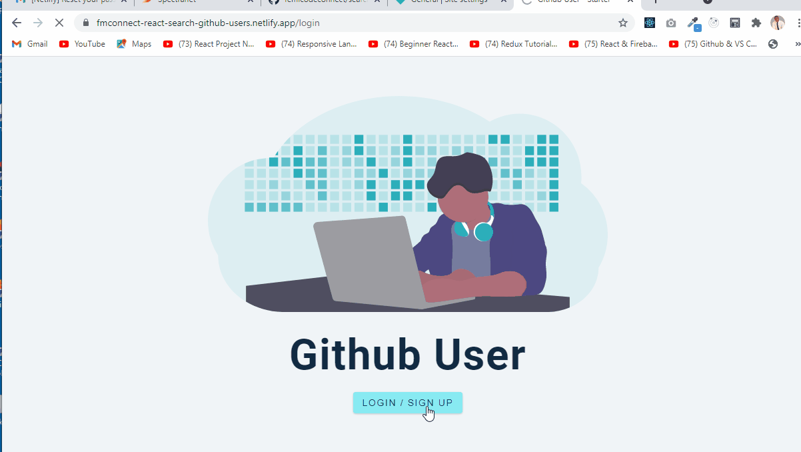

# Homepage



[view page](https://fmconnect-react-search-github-users.netlify.app/)

## Implementation

-  Extracting specific data from data chunk returned by api call
-  Reformatting extracted data for use in components
-  Illustrating how to use mock data b4 fetching data from an api
-  Illustrating how to use FusionCharts to create different types of charts
-  Illustrated how to build a data structure from fetched data by using the javascript reduce function - various ways of using a reduce function.
-  Using Object.value() to convert an object into an array
-  Using axios.then().catch() to fetch data from an API
-  Using async/await with axios to fetch data from an API
-  How to automatically fetch data from an api when the app loads
-  Destructuring the data from the response received from a fetch request with axios.
-  An elaborate error handling system
-  Implement the use of Promise.allSettled()
-  Show how to add authentication to a project
-  Illustrate how to setup private routes

## Starter Project

-  css provided (global styles, styled components)
-  folders/files already setup
-  all imports included (warnings)
-  index.js for easier imports

## Styled Components

Styled Components allows the scoping of styles to a specific component.

[Styled-Components - Main Docs](https://styled-components.com/)

```jsx
import styled from "styled-components";

const ReactComponent = () => {
 // logic here
 return <Wrapper>
 {some content}
 </Wrapper>
}


const Wrapper = styled.htmlElement`
write your styles here
`
export default ReactComponent
```

## React Icons

[React Icons - Main Docs](https://react-icons.github.io/react-icons/)

```jsx
import { FiUsers, FiUserPlus } from 'react-icons/fi';
<FiUsers className='nameOfTheClass'> </FiUsers>;
```

## React Router Dom

version used - "react-router-dom": "^5.2.0",

-  [react-router-dom - Main Docs](https://reactrouter.com/web/guides/quick-start)

-  <Switch> renders the first child <Route> that matches
-  A <Route path="*"> always matches

## Gihthub API

-  [Root Endpoint](https://api.github.com)
-  [Get User](https://api.github.com/users/wesbos)
-  [Repos](https://api.github.com/users/john-smilga/repos?per_page=100)
-  [Followers](https://api.github.com/users/john-smilga/followers)
-  [Rate Limit](https://api.github.com/rate_limit)

   For unauthenticated requests, the rate limit allows for up to 60 requests per hour. Unauthenticated requests are associated with the originating IP address, and not the user making requests.

## Fusion Charts

-  [Fusion Charts - Main Docs](https://www.fusioncharts.com/)
-  [First React Chart](https://www.fusioncharts.com/dev/getting-started/react/your-first-chart-using-react)
-  [List Of Charts](https://www.fusioncharts.com/dev/chart-guide/list-of-charts)
-  [Themes](https://www.fusioncharts.com/dev/themes/introduction-to-themes)

## Auth0

-  [Auth0 - Main Docs](https://auth0.com/)

-  Create Application
-  Choose : Single Page Web Applications
-  Choose : React
-  Go to Settings Tab
-  Copy/Paste Domain, ClientID - can be public (or use .env)
-  Add Domain -
   for now http://localhost:3000 (DON'T COPY PASTE FROM URL BAR)

   -  Allowed Callback URLs
   -  Allowed Logout URLs
   -  Allowed Web Origins
   -  SAVE CHANGES!!!!!!!!!!!!!!!

-  Connections
   email,social

-  [React SDK Docs](https://auth0.com/docs/libraries/auth0-react)
-  [REACT SDK API Docs](https://auth0.github.io/auth0-react/)

## Deployment

[Netlify](https://www.netlify.com/)

## Additional Info

#### Redirects with react-router-dom

In order for routing to work on netlify, redirects was added to the public folder

-  \_redirects file in public

```

/*    /index.html   200

```

[Redirects Blog Post](https://dev.to/dance2die/page-not-found-on-netlify-with-react-router-58mc)

#### Warnings and create-react-app

package.json

```js
"build": "CI= react-scripts build",
```

[create-react-app Warning Fix Blog Post](https://community.netlify.com/t/how-to-fix-build-failures-with-create-react-app-in-production/17752)
